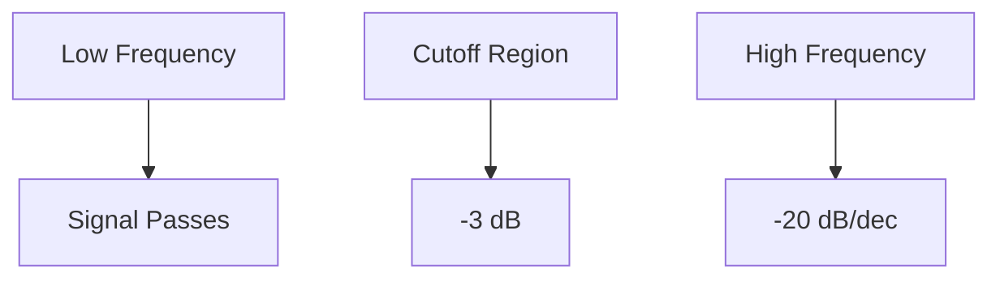

# LOW PASS FILTER RC

---

## Overview
This project demonstrates the modeling, simulation, and analysis of a **first-order RC low-pass filter** using **PLECS** and **ltspice**.

It includes:
- Parametric sweep setup
- AC Sweep (frequency response)
- Bode plot analysis (magnitude & phase)
- Cutoff frequency extraction

---

## Circuit Description

The circuit is a standard **RC low-pass filter**:

- **R**: Series resistor  
- **C**: Capacitor to ground  
- Output taken across the capacitor  

---

## Theory

### Transfer Function

`H(jω) = 1 / (1 + jωRC)`

---

### Cutoff Frequency

`f_c = 1 / (2πRC)`

At this frequency:
- Gain   = **-3 dB**
- Phase  = **-45°**

---

### Frequency Behavior

| Region            | Behavior                  |
|------------------|--------------------------|
| Low frequency     | Passes signal (~0 dB)     |
| Cutoff frequency  | -3 dB point               |
| High frequency    | Attenuates (-20 dB/dec)   |

---

## Simulation Setup

### 1. Parametric Sweep
Used to vary component values (R and/or C) and observe system behavior.

---

### 2. AC Sweep Configuration

- Analysis Type: **AC Sweep**
- Frequency Range: `1 Hz → 1 MHz`
- Amplitude: `1`
- Operating Point: Periodic

---

### 3. Perturbation / Response Method

PLECS uses:
- **Perturbation block** → injects signal
- **Response block** → measures output

This automatically computes:

`H(f) = response/perturbation`

---

## Results – Bode Plot

### Magnitude & Phase

### Observations

- Flat response at low frequency (~0 dB)
- Roll-off at **-20 dB/decade**
- Phase shifts from **0° to -90°**
- Cutoff occurs at:
  - Magnitude = **-3 dB**
  - Phase ≈ **-45°**

---

## Cutoff Frequency Extraction

### Method 1 – Visual (PLECS)

1. Open Bode plot
2. Move cursor to:
   - Magnitude ≈ **-3 dB**
3. Read frequency

---

### Method 2 – Data Export

1. Export plot data to CSV
2. Find frequency where:

`|H(f)| = 1\sqrt{2}`

---

## Frequency Response Behavior

---

