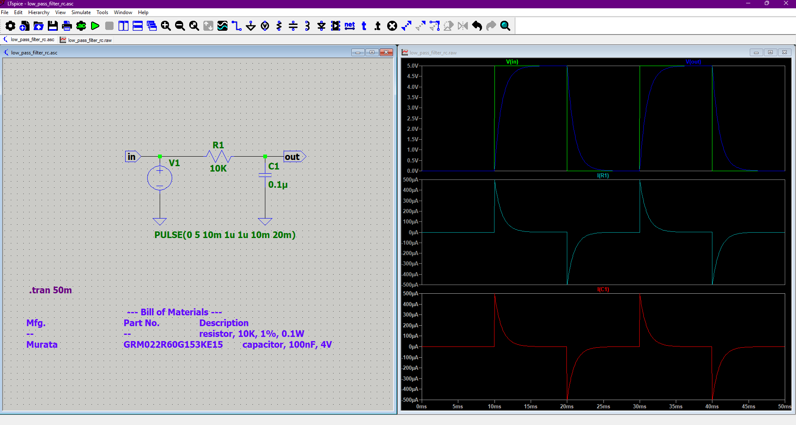
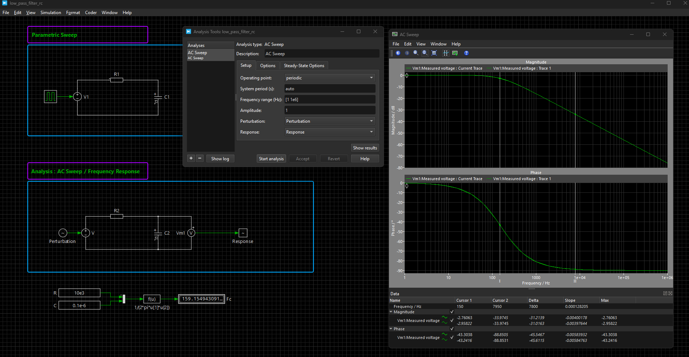
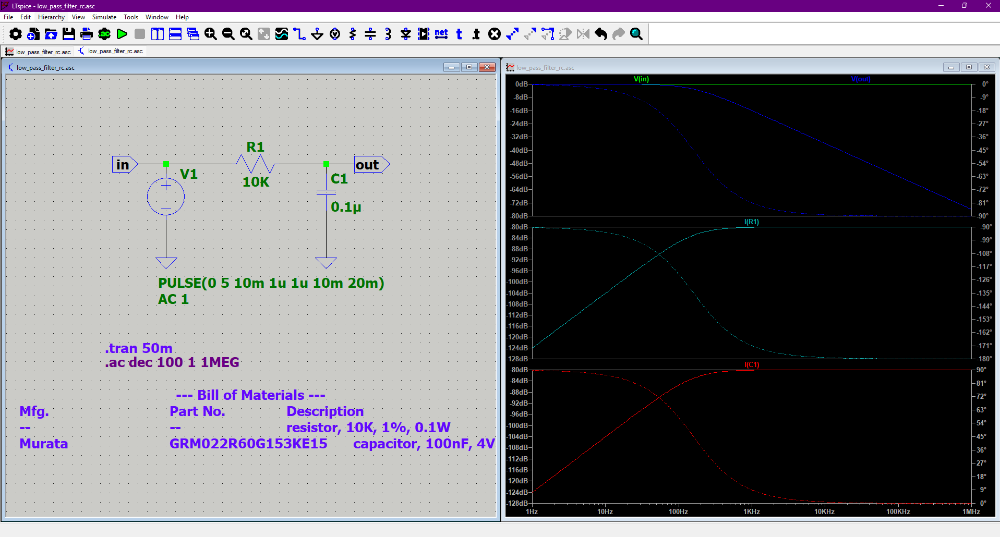
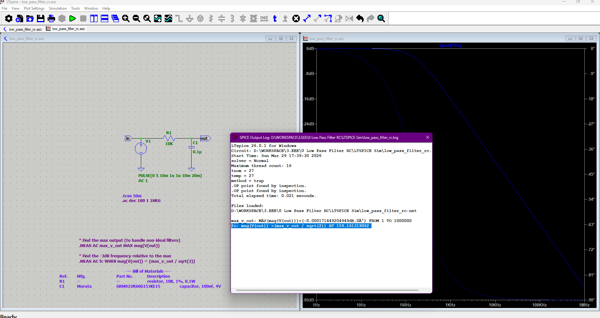
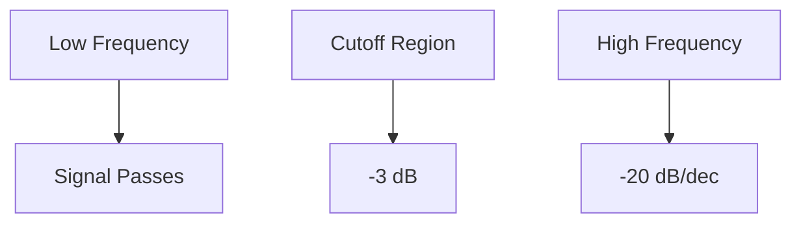
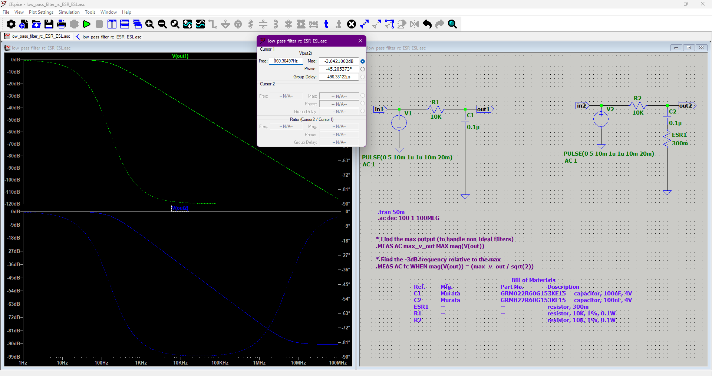
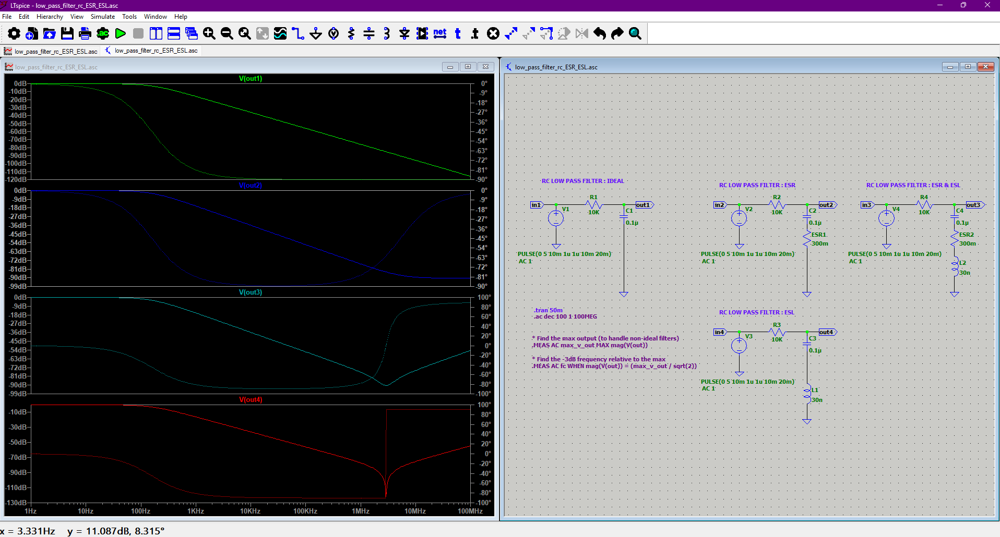

# LOW PASS FILTER RC

---

## Overview
This project demonstrates the modeling, simulation, and analysis of a **first-order RC low-pass filter** using **PLECS** and **ltspice**.

It includes:
- Parametric sweep setup
- AC Sweep (frequency response)
- Bode plot analysis (magnitude & phase)
- Cutoff frequency extraction

---

## Circuit Description

The circuit is a standard **RC low-pass filter**:

- **R**: Series resistor  
- **C**: Capacitor to ground  
- Output taken across the capacitor  

---

## Theory

### Transfer Function

`H(jω) = 1 / (1 + jωRC)`

---

### Cutoff Frequency

`f_c = 1 / (2πRC)`

At this frequency:
- Gain   = **-3 dB**
- Phase  = **-45°**

---

### Frequency Behavior

| Region            | Behavior                  |
|------------------|--------------------------|
| Low frequency     | Passes signal (~0 dB)     |
| Cutoff frequency  | -3 dB point               |
| High frequency    | Attenuates (-20 dB/dec)   |

---

## Simulation Setup

### 1. Parametric Sweep
Used to vary component values (R and/or C) and observe system behavior.

---

### 2. AC Sweep Configuration

- Analysis Type: **AC Sweep**
- Frequency Range: `1 Hz → 1 MHz`
- Amplitude: `1`
- Operating Point: Periodic

---

### 3. Perturbation / Response Method

PLECS uses:
- **Perturbation block** → injects signal
- **Response block** → measures output

This automatically computes:

`H(f) = response/perturbation`

---

## Results – Bode Plot

### Magnitude & Phase

### Observations

- Flat response at low frequency (~0 dB)
- Roll-off at **-20 dB/decade**
- Phase shifts from **0° to -90°**
- Cutoff occurs at:
  - Magnitude = **-3 dB**
  - Phase ≈ **-45°**

---

## Cutoff Frequency Extraction

### Method 1 – Visual (PLECS)

1. Open Bode plot
2. Move cursor to:
   - Magnitude ≈ **-3 dB**
3. Read frequency

---

### Method 2 – Data Export

1. Export plot data to CSV
2. Find frequency where:

`|H(f)| = 1\sqrt{2}`

---

## Frequency Response Behavior

---

## Principle of Operation

A first-order RC low-pass filter allows low-frequency signals to pass while attenuating high-frequency components. This behavior arises from the frequency-dependent impedance of the capacitor.

The impedance of the capacitor is given by:

`X_c = 1 / (2π f C)`

where:

* `f `is the signal frequency
* `C `is the capacitance

---

## Frequency-Dependent Behavior

### Low-Frequency Regime

At low frequencies (`f → 0`):

`X_c → ∞`

The capacitor behaves as an open circuit. As a result, very little current flows through the capacitor, and the output voltage across the capacitor is approximately equal to the input voltage:

`V_out ≈ V_in`

Thus, low-frequency signals pass through the circuit with minimal attenuation.

---

### High-Frequency Regime

At high frequencies (`f → ∞`):

`X_c → 0`

The capacitor behaves as a short circuit to ground. Most of the input signal current is diverted through the capacitor, and the output voltage becomes very small:

`V_out ≈ 0`

Thus, high-frequency signals are strongly attenuated.

---

## Transfer Function

The circuit can be analyzed as a voltage divider composed of a resistor and a frequency-dependent impedance:

`V_out = V_in × (Z_c / (R + Z_c))`

Substituting `Z_c = 1 / (jωC) `with `ω = 2πf`, the transfer function becomes:

`H(jω) = V_out / V_in = 1 / (1 + jωRC)`

---

## Cutoff Frequency

The cutoff frequency is defined as the point where the magnitude of the output drops to `1/√2 `of the input (corresponding to -3 dB). This occurs when the magnitudes of the resistor and capacitor impedances are equal:

`|Z_c| = R`

Solving for frequency gives:

`f_c = 1 / (2πRC)`

At this frequency:

* The output magnitude is reduced by a factor of `1/√2`
* The phase shift is `-45°`

---

## Physical Interpretation

The capacitor stores and releases energy in the form of an electric field. Its ability to charge and discharge depends on how quickly the input signal changes:

* For slow variations (low frequencies), the capacitor has sufficient time to charge and discharge gradually, resulting in minimal current flow and little impact on the signal.
* For rapid variations (high frequencies), the capacitor continuously charges and discharges, drawing significant current and effectively shunting the signal to ground.

This behavior causes the circuit to act as a frequency-dependent filter, passing low-frequency components while suppressing high-frequency ones.

---

## High-Frequency Attenuation

At frequencies much higher than the cutoff (`f >> f_c`), the magnitude of the transfer function decreases approximately as:

`|H(jω)| ≈ 1 / (ωRC)`

In logarithmic (dB) scale:

`20 log10 |H(jω)| ≈ -20 log10(f)`

This corresponds to a slope of:

`-20 dB/decade`

which is characteristic of a first-order low-pass filter.

---

## Interpretation of Magnitude and Phase in Real Circuits

When analyzing a circuit in the frequency domain, such as with a Bode plot, the response is described by a complex transfer function:

`H(jω) = V_out / V_in`

This quantity contains two essential pieces of information:

* **Magnitude** → how much the signal amplitude changes
* **Phase** → how much the signal is delayed in time

---

## Magnitude (Gain)

The magnitude represents the ratio of output amplitude to input amplitude:

`|H(jω)| = |V_out| / |V_in|`

It is often expressed in decibels (dB):

`Gain(dB) = 20 log10(|V_out / V_in|)`

###  Meaning

* If ` |H| = 1 ` (0 dB): the signal passes unchanged
* If ` |H| < 1 `       : the signal is attenuated
* If ` |H| > 1 `       : the signal is amplified

In the RC low-pass filter:

* Low frequencies  →  `|H| ≈ 1 ` → signal passes
* High frequencies → `|H| ≈ 0 ` → signal is suppressed

### Interpretation

Magnitude directly corresponds to **signal strength**:

* Voltage amplitude in analog circuits
* Power transmission in RF systems
* Signal level in audio systems

---

## Phase

The phase represents the shift in time between input and output signals:

`φ(ω) = angle(H(jω))`

It is measured in degrees or radians.

---

## Time-Domain Meaning of Phase

A phase shift corresponds to a **time delay**:

`Δt = φ / (2πf)`

So the output signal is effectively a delayed version of the input.

---

## Physical Meaning

In an RC low-pass filter:

* At low frequency → `φ ≈ 0°`
  → output follows input almost instantly

* At cutoff frequency → `φ = -45°`
  → output is delayed by 1/8 of a period

* At high frequency → `φ ≈ -90°`
  → output is significantly delayed and reduced

---

## Why Phase Appears

Phase shift is caused by **energy storage elements**:

* Capacitors store energy in electric fields
* Inductors store energy in magnetic fields

In the RC circuit:

* The capacitor takes time to charge and discharge
* This creates a delay between input voltage and output voltage

---

At any frequency:

`V_out(t) = |H| × V_in(t - Δt)`

---
## Effect of Capacitor ESR (Non-Ideal Behavior)

### Non-Ideal Capacitor Model

In real circuits, a capacitor includes an **Equivalent Series Resistance (ESR)**.  
The impedance becomes:

` Z_c = ESR + 1 / (jωC) `

---

### Modified Transfer Function

The circuit is now a voltage divider between ` R ` and ` Z_c `:

` H(jω) = V_out / V_in = Z_c / (R + Z_c) `

Substituting:

` H(jω) = (ESR + 1/(jωC)) / (R + ESR + 1/(jωC)) `

Rewriting:

` H(jω) = (jωC·ESR + 1) / (jωC(R + ESR) + 1) `

---

### Pole–Zero Structure

Unlike the ideal RC filter, the ESR introduces a **zero**:

- Pole:
  
  ` f_p = 1 / (2π (R + ESR) C) `

- Zero:
  
  ` f_z = 1 / (2π ESR · C) `

---

### Frequency Response Behavior

#### Low Frequency

` H ≈ 1 `

The circuit behaves like an ideal low-pass filter.

---

#### Around Cutoff

The cutoff frequency is slightly shifted:

` f_c ≈ 1 / (2π (R + ESR) C) `

If ` ESR << R `, the effect is minimal.

---

#### High Frequency

The capacitor behaves like a resistor:

` Z_c ≈ ESR `

So the circuit becomes a resistive divider:

` H(∞) = ESR / (R + ESR) `

This explains why the magnitude **does not go to zero**.

---

### Explanation of the Simulation

From the plot:

- The ideal filter continues decreasing at **-20 dB/dec**
- The non-ideal filter:
  - Follows the same slope initially
  - Then **flattens at high frequency**

The flat level corresponds to:

` 20 log10(ESR / (R + ESR)) `

---

### Phase Behavior

- Ideal filter:
  
  ` 0° → -90° `

- With ESR:
  - Phase decreases initially
  - Then **returns toward 0° at high frequency**

This occurs because the circuit becomes purely resistive again.

---

### Physical Interpretation

At high frequency:

- The capacitor no longer behaves as a short circuit  
- It behaves as a **small resistor (ESR)**  
- The signal is no longer fully shunted to ground  

---
## Effect of Capacitor ESL and Combined ESR + ESL

### Non-Ideal Capacitor Model (ESR + ESL)

A real capacitor includes both:
- **ESR (Equivalent Series Resistance)**
- **ESL (Equivalent Series Inductance)**

The impedance becomes:

` Z_c = ESR + jωL + 1 / (jωC) `

---

## Case 1: ESL Only

### Impedance

` Z_c = jωL + 1 / (jωC) `

---

### Transfer Function

` H(jω) = Z_c / (R + Z_c) `

---

### Key Effect: Resonance

The capacitor and ESL form an LC resonant circuit. The resonance frequency is:

` f_0 = 1 / (2π √(LC)) `

---

### Frequency Behavior

- Low frequency:
  
  ` Z_c ≈ 1 / (jωC) → large `  
  → Normal low-pass behavior

- At resonance:
  
  ` ωL = 1 / (ωC) `  
  → ` Z_c ≈ 0 `  
  → Output drops to **minimum**

- High frequency:
  
  ` Z_c ≈ jωL `  
  → Output increases again

---

### Simulation Observation

- A **deep notch** appears in the magnitude
- The filter no longer behaves as a simple low-pass
- Phase shows a sharp transition around resonance

---

### Physical Interpretation

- At resonance, energy oscillates between:
  - Electric field (capacitor)
  - Magnetic field (inductor)

- The impedance becomes very small → signal is strongly shunted to ground

---

## Case 2: ESR + ESL

### Impedance

` Z_c = ESR + jωL + 1 / (jωC) `

---

### Transfer Function

` H(jω) = Z_c / (R + Z_c) `

---

### Key Effects

This combines both previous behaviors:

1. **Resonance (from ESL)**
2. **Damping (from ESR)**
3. **High-frequency leakage (from ESR)**

---

### Frequency Behavior

#### Low Frequency

` H ≈ 1 `  
→ Same as ideal filter

---

#### Around Resonance

- A **notch or dip** appears
- Less sharp than ESL-only case due to ESR damping

---

#### High Frequency

Capacitor behaves like:

` Z_c ≈ ESR + jωL `

So:

` H(∞) ≈ (ESR + jωL) / (R + ESR + jωL) `

- Output **does not go to zero**
- Magnitude may **rise after the dip**

---

### Simulation Observation

- The deep notch becomes **shallower**
- The response **recovers at high frequency**
- Phase becomes smoother compared to ESL-only

---

## Comparison Summary

| Model        | Behavior |
|-------------|--------|
| Ideal C      | Pure low-pass (-20 dB/dec) |
| ESR only     | Flattens at high frequency |
| ESL only     | Resonance notch appears |
| ESR + ESL    | Damped resonance + high-frequency leakage |

---

## Physical Insight

- **ESL dominates high-frequency behavior**
  - Causes resonance and non-monotonic response

- **ESR provides damping**
  - Reduces oscillations
  - Limits peak or depth of resonance

---
